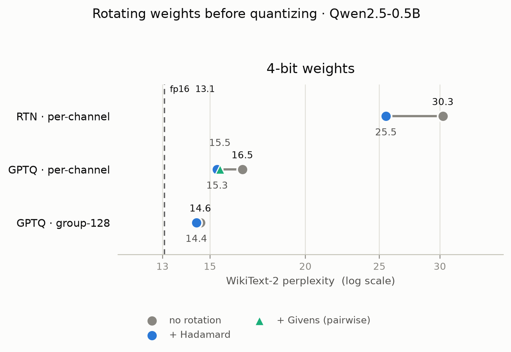
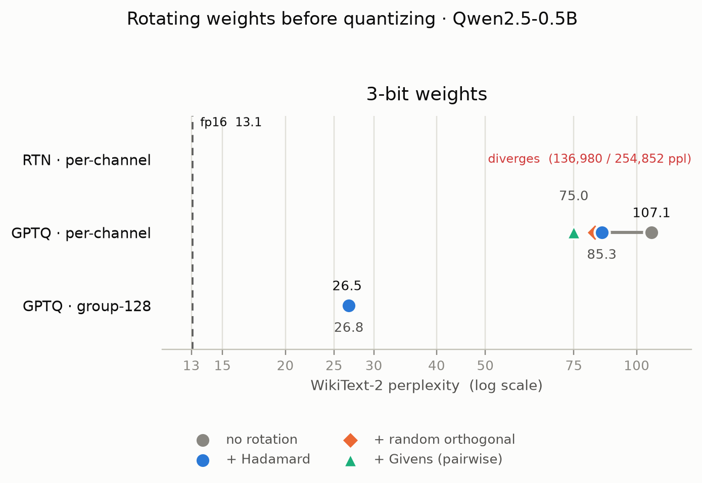

# PTQ from scratch: a rotation ablation

Post-training quantization of a small LLM, implemented from first principles, to
reproduce the central finding of **QuaRot** (Ashkboos et al., 2024): rotating the
weights and activations of a transformer by an orthogonal matrix before
quantizing removes the outlier channels that otherwise force a coarse
quantization grid, and this is what makes aggressive low-bit (3-4 bit)
quantization work.

Nothing here wraps `bitsandbytes` or `AutoGPTQ`. The RTN quantizer, the GPTQ
inverse-Hessian update, and the rotation fusion are all written out so every line
is explainable.

## What's implemented

| Piece | File | Notes |
|---|---|---|
| RTN baseline | `ptq/rtn.py`, `ptq/quant.py` | per-channel / per-group, symmetric or asymmetric. The control group. |
| GPTQ | `ptq/gptq.py` | Hessian from calibration activations, Cholesky-based inverse, column-wise OBQ error compensation (Algorithm 1 + 2 of the paper). Block-by-block so only one block's Hessians are resident. |
| Rotation (mini-QuaRot) | `ptq/rotation.py` | R1: fuse RMSNorm scales into adjacent linears, then rotate the residual stream by a Hadamard, random orthogonal, or Givens (composed pairwise rotations, no power-of-two constraint) matrix. Function-preserving via computational invariance. |
| Perplexity | `ptq/eval_ppl.py` | WikiText-2, non-overlapping windows - the standard PTQ metric. |
| Memory / throughput | `ptq/benchmark.py` | theoretical bytes-streamed-per-token + measured tokens/s. |

R2/R3/R4 from QuaRot (head-wise value rotation, online Hadamard before
`down_proj`) and KV-cache quantization are **not** done - R1 alone already shows
the effect. See "Extensions".

## Setup

```bash
python3 -m venv .venv && source .venv/bin/activate
pip install -r requirements.txt
export PYTORCH_ENABLE_MPS_FALLBACK=1   # only needed on Apple MPS
```

Default model is `Qwen/Qwen2.5-0.5B` - small enough to run the whole pipeline on
an M2/8GB laptop. The GPTQ linear algebra runs in float64: on CUDA it stays on
the GPU, on MPS it falls back to CPU (MPS has no float64).

## Run

```bash
# one config
python -m scripts.run_experiment --method fp16
python -m scripts.run_experiment --method rtn  --bits 4
python -m scripts.run_experiment --method gptq --bits 3 --rotation hadamard --groupsize 128

# the whole ablation grid -> results/*.json + a summary table
python -m scripts.run_ablation --nsamples 128 --calib-seqlen 2048
python -m scripts.plot                       # -> results/ablation_{4,3}bit[_dark].png

# fast pass while iterating (fp16/RTN/4-bit GPTQ only - see caveat below):
python -m scripts.run_ablation --limit-windows 20 --nsamples 32
```

Each run writes `results/<tag>.json`. `run_ablation.py` runs every config in a
subprocess (so GPU/MPS memory is released between runs) and prints the summary
table below. To run on a rented GPU, `scripts/runpod_setup.sh` does the whole
thing on a fresh CUDA pod.

> **Caveat:** `H = XᵀX` is always positive-semidefinite in theory, but with too
> few calibration tokens for the hidden size (e.g. `--nsamples 32
> --calib-seqlen 512` = 16k tokens for a 896-dim Hessian), it can be
> ill-conditioned enough that `torch.linalg.cholesky` fails outright, or 3-bit
> quantization diverges without erroring at all - happens at `--bits 3`
> regardless of rotation, `--bits 4` was not observed to be affected. Use the
> fast pass for iterating on the 4-bit/RTN/fp16 path; for real 3-bit GPTQ
> numbers, use the full `--nsamples 128 --calib-seqlen 2048`.

## The result

`Qwen/Qwen2.5-0.5B`, WikiText-2 perplexity (seqlen 2048, full test set), GPTQ
calibrated on 128 sequences x 2048 tokens, symmetric weights, run on an RTX 3090.

Grouped by bit-width first, since that's the axis you actually want to compare
across (a 4-bit config against another 4-bit config, not against a 3-bit one) -
`fp16` and `RTN 8-bit` are the reference points everything else is measured
against:

| method | bits | ppl | vs fp16 |
|---|---|---:|---:|
| fp16 | 16 | **13.07** | - |
| RTN  | 8  | 13.09     | +0.02 |

#### 4-bit weights

| method | grouping | rotation | ppl | vs fp16 |
|---|---|---|---:|---:|
| GPTQ | per-channel | none     | 16.54     | +3.47 |
| GPTQ | per-channel | hadamard | 15.33     | +2.26 |
| GPTQ | per-channel | givens   | 15.46     | +2.39 |
| RTN  | per-channel | none     | 30.26     | +17.19 |
| RTN  | per-channel | hadamard | 25.50     | +12.43 |
| GPTQ | group-128   | none     | 14.57     | +1.50 |
| GPTQ | group-128   | hadamard | 14.40     | +1.33 |

#### 3-bit weights

| method | grouping | rotation | ppl | vs fp16 |
|---|---|---|---:|---:|
| GPTQ | per-channel | none     | 107.09    | +94.02 |
| GPTQ | per-channel | hadamard | 85.27     | +72.20 |
| GPTQ | per-channel | random   | 82.61     | +69.54 |
| GPTQ | per-channel | givens   | **74.98** | +61.91 |
| RTN  | per-channel | none     | 136,980   | diverges |
| RTN  | per-channel | hadamard | 254,852   | diverges |
| GPTQ | group-128   | none     | 26.55     | +13.48 |
| GPTQ | group-128   | hadamard | 26.76     | +13.69 |

<picture>
  <source media="(prefers-color-scheme: dark)" srcset="results/ablation_4bit_dark.png">
  
</picture>

<picture>
  <source media="(prefers-color-scheme: dark)" srcset="results/ablation_3bit_dark.png">
  
</picture>

### Reading the table

1. **The quantizer is sound.** RTN-8 sits within 0.02 ppl of fp16, so damage at
   4/3-bit is real quantization difficulty, not a bug.

2. **GPTQ's error feedback matters.** At 4-bit it nearly halves RTN's gap to
   fp16 (16.5 vs 30.3) by compensating each column's rounding error against
   the columns not yet quantized.

3. **Rotation helps in the coarse regime - any orthogonal matrix will do.**
   Hadamard improves every setting tried: RTN-4 30.3&rarr;25.5, GPTQ-4
   16.5&rarr;15.3, GPTQ-3 107&rarr;85. A *random* orthogonal matrix does the
   same (82.6, indistinguishable from Hadamard's 85.3) - the mechanism is
   "mix every channel into every other," and Hadamard is just the cheap
   structured way to do it.

4. **Qwen's hidden size (896 = 128&times;7) breaks that cheapness.**
   `hadamard_matrix()` falls back to a partial `kron()` mix, which is why
   Hadamard alone can't rescue 3-bit (still 85 ppl). Givens rotation (no
   power-of-two constraint) reaches **74.98 ppl** instead - better than both
   the partial Hadamard and a full random draw - confirming it was the shape
   mismatch, not the mechanism, holding 3-bit back.

5. **Group scales are the bigger lever here.** group-128 takes 3-bit from
   107&rarr;26.5 and 4-bit to within 1.5 ppl of fp16; once scales are local,
   adding rotation on top changes almost nothing (14.57&rarr;14.40,
   26.55&rarr;26.76). Rotation earns its keep when you want a single scale
   per channel instead.

## Why rotation works

1. **The outlier problem.** A few activation channels run 10-100x larger than
   the rest; since the quantization scale is set by the largest value, every
   ordinary value gets squeezed onto 1-2 effective levels.

2. **What rotation does.** An orthogonal `Q` mixes every channel into every
   other, spreading a spike into a near-Gaussian shape with a much smaller
   max/RMS ratio. Hadamard (`O(n log n)`, needs power-of-two `n`), a random QR
   draw, and composed Givens rotations (`O(n)` per layer, no size constraint)
   are three ways to build one - on Qwen's non-power-of-two hidden size,
   Givens won.

3. **Why it's free at inference.** RMSNorm only divides by its input's norm,
   which rotation preserves - so folding the norm's scale into the weights
   first, then rotating everything entering/leaving the residual stream by
   `Q`/`Q^T`, changes nothing about the function. `apply_rotation` confirms
   it: fp16 ppl moves by <0.01.

4. **Why it matters at all.** Decode is bandwidth-bound - time per token is
   roughly bytes moved / HBM bandwidth - so cutting weight bits directly cuts
   latency. Rotation is what lets that cut reach 3-4 bits without accuracy
   collapsing, provided it achieves genuine full-rank mixing.

## Extensions

- Llama-3.2-1B (hidden 2048): a clean power-of-two Hadamard, as the direct
  comparison point for how a *full* Hadamard stacks up against Givens rotation
  on the same architecture, now that both are implemented
- Learned Givens angles instead of random ones (ParoQuant optimizes them; here
  they're drawn once from a fixed seed) - likely closes more of the remaining
  gap to random/full-Hadamard mixing
- KV-cache int8/int4 (the long-context bandwidth bottleneck)
- R2/R3/R4 rotations for activation quantization (W4A4)
- packed int4 storage + a real fast kernel (Marlin) for a measured tokens/s number

## References

- Frantar et al., *GPTQ: Accurate Post-Training Quantization for Generative
  Pre-trained Transformers*, 2023
- Ashkboos et al., *QuaRot: Outlier-Free 4-Bit Inference in Rotated LLMs*, 2024
- Liang, Chen, Han, Liu, *ParoQuant: Pairwise Rotation Quantization for
  Efficient Reasoning LLM Inference*, 2025 (the Givens-rotation idea used here)
- Chee et al., *QuIP*, 2023; Tseng et al., *QuIP#*, 2024 (incoherence processing)
